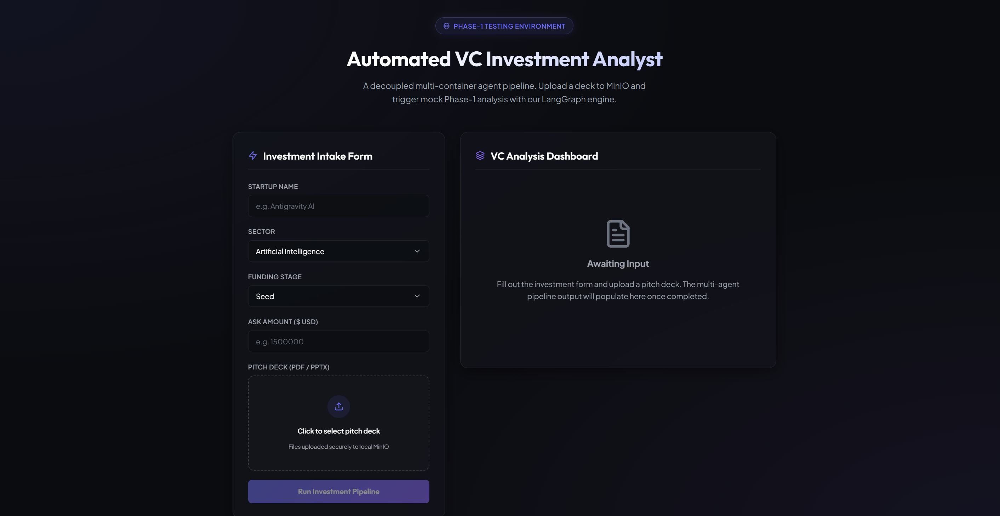

# 🕵️‍♂️ Automated Venture Capital (VC) Investment Analyst

Autonomous multi-agent research platform built with LangGraph orchestration, FastAPI microservices, and production-grade infrastructure to evaluate startup pitch decks and compile institutional-grade investment memos.



---

## 🏗️ Architecture

The monorepo separates our core system concerns into independent, containerized services working inside a private Docker bridge network:

```
                  ┌──────────────────────┐
                  │  Client Browser UI   │
                  │  (React / Vite)      │
                  └──────────┬───────────┘
                             │
            ┌────────────────┴────────────────┐
            │                                 │
            ▼ (1. Get Presigned URL)          ▼ (2. PUT Upload File Binary)
┌───────────────────────┐            ┌───────────────────────┐
│    Backend Gateway    │            │     MinIO Storage     │
│       (FastAPI)       │            │  (S3-Compatible Object│
└──────────┬────────────┘            └──────────┬────────────┘
           │ (3. POST Form Payload              │
           │     w/ File Path)                  │
           ▼                                    │ (4. Fetch File Bytes)
┌───────────────────────┐                       │
│    Analyst Engine     │◄──────────────────────┘
│ (FastAPI & LangGraph) │
└───────────────────────┘
```

---

## 📁 Directory Structure

- **`apps/ui`**: React + Vite frontend served via Nginx (Port 3000) with a premium, sleek Claude-inspired dark aesthetic.
- **`apps/backend`**: REST API Gateway (Port 8000) managing presigned upload URLs, database credentials, and MinIO S3 bucket integrations.
- **`apps/analyst`**: Core AI Analyst Service (Port 8001) driven by FastAPI, LangGraph, and a multi-agent investment committee.

---

## 🚀 Quick Start (Local Development)

### 1. Configure the Environment
Create a `.env` file in `apps/analyst/` to set your credentials:
```env
OPENAI_API_KEY=your_openai_key_here
TAVILY_API_KEY=your_tavily_key_here
```

### 2. Boot the Full Stack (Docker Compose)
From the root of the repository, compile and launch the microservices in the background:
```bash
docker compose up --build -d
```

To run only the **Analyst Engine** along with its web search and database dependencies:
```bash
docker compose up --build -d analyst postgres minio searxng
```

### 3. Setup Python Dependencies (Local In-Memory Mode)
If running outside of Docker using the high-performance `uv` package manager:
```bash
# Sync dependencies in the analyst application folder
cd apps/analyst
uv sync
```

---

## 🔗 Port Mapping

| Service | Protocol / API | Local Endpoint |
| :--- | :--- | :--- |
| **Frontend Web UI** | React Dashboard | [http://localhost:3000](http://localhost:3000) |
| **Backend Gateway** | FastAPI Swagger Docs | [http://localhost:8000/docs](http://localhost:8000/docs) |
| **Analyst Agent API** | FastAPI Swagger Docs | [http://localhost:8001/docs](http://localhost:8001/docs) |
| **MinIO Console** | S3 Browser UI | [http://localhost:9001](http://localhost:9001) |
| **PostgreSQL** | Checkpoint Database | `localhost:5432` (`db: vc_analyst`) |
| **SearXNG** | Metasearch Engine | [http://localhost:8080](http://localhost:8080) |

---

## 🛠️ Features

- **Ingestion OCR & Scraper Loop**: Automated ingestion parsing PDFs/PPTXs slide-by-slide via Vision Language Models (VLM OCR) fallback. Extracts domain URLs using Regex and crawls the site concurrently for context.
- **Single-Pass Joint-Context Extraction**: Joint context parsing (`raw_deck_text` + `raw_website_text`) feeds 5 parallel extraction nodes simultaneously, avoiding redundant LLM queries.
- **State-Driven Python Hybrid Routing**: Programmatic Python `conditional_edges` and strict max attempt limits prevent infinite agent loops and lower latency compared to LLM-supervisor patterns.
- **Dynamic Multiphase Agentic IC Debate**: 
  - **Factual Drafting (Phase 1):** Parallel section writers draft Markdown copy.
  - **Advisory Debate (Phase 2):** Two adversarial nodes ("The Bull" and "The Bear") debate investment thesis and risks, while specialized action agents provide actionable strategic directives.
- **LLM-as-a-Judge Fact Auditor**: Strict factual integrity audit (`memo_reviewer`) checking numerical claims and company red flags, automatically routing rejected drafts back for revisions (max 2 review cycles).
- **Dual PDF Compilation Engine (Phase 3)**:
  - **Pattern A (Web-Sleek PDF via Playwright)**: High-density CSS/Jinja2 layout.
  - **Pattern B (Institutional Typst PDF)**: Beautiful, typographically elegant rendering via Jinja2-rendered Typst code.
- **Zero-API Offline Testing Mode**: Set `MOCK_LLM=true` in your environment to intercept all text, vision, and LangChain model bindings, recursively mock pydantic schemas, and run/debug the full graph completely offline with **zero cost and zero dependencies**.
- **Deep-Merging State Reducers**: Structured, nested map-reducer schemas that completely eliminate parallel graph write-collisions, ensuring data consistency across company, market, and competitor profiles.