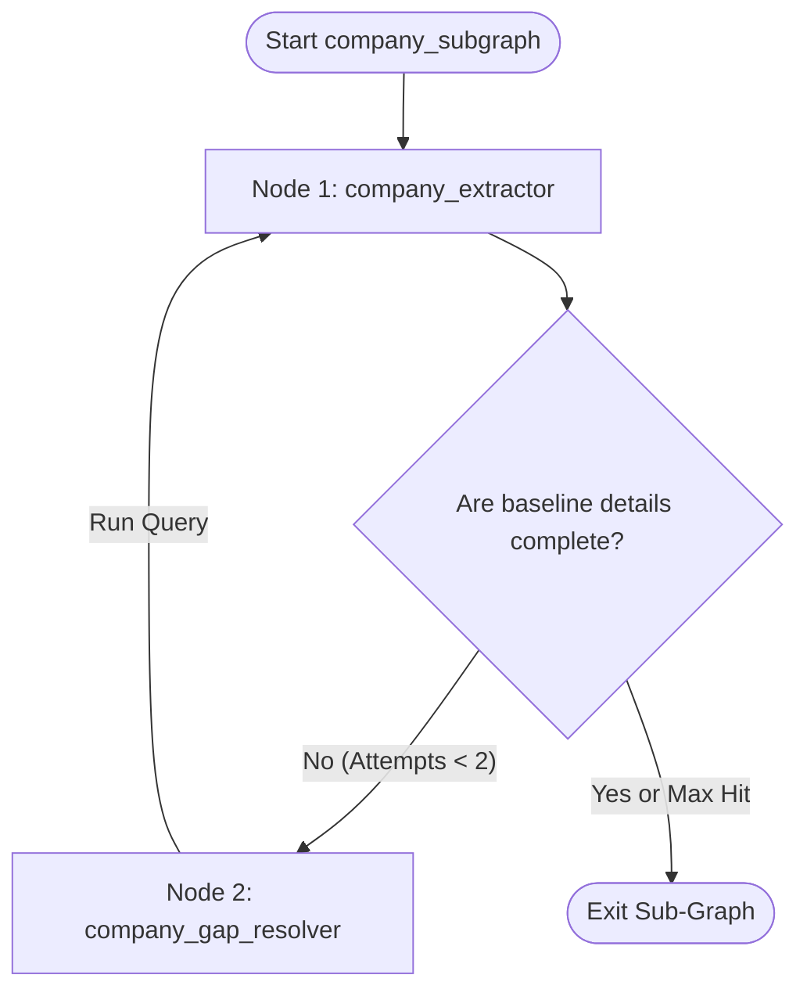

# Sub-Graph Specification: Company Sub-Graph (company_subgraph)

## Aim
Extract and verify high-level company identity, founding details, problem statement, solution, sector, geography, and business model metrics from the aggregated raw data, and verify missing baseline items via single-shot research before parallel sub-graphs execute.

---

## 1. Sub-Graph Architecture
The Company Sub-Graph runs sequentially after the Intake Phase.

---

## 2. Shared State & Schema Boundaries
The sub-graph reads from the global `PipelineGraphState` and writes strictly to the **`AnalysisState.company`** namespace (`CompanySchema` in `vs_analyst/schemas/company.py`).

---

## 3. Node Specifications

### 3.1 Node 1: `company_extractor`
* **Aim**: Perform primary extraction from raw deck and website scraped text.
* **Inputs**:
  - `PipelineGraphState.raw_deck_text`
  - `PipelineGraphState.raw_website_text`
* **Tools Available**: None.
* **Working Flow**:
  1. Invoke the LLM with `.with_structured_output(CompanyAdaptor)` from `@schemas/adapters.py`.
  2. Provide a prompt (`PromptRegistry.deck_company`) instructing the model to prioritize factual extraction, cross-referencing deck and website context, and resolving conflicts in favor of the website for current metrics (employee count) and the deck for intent-based metrics.
  3. Write the extracted fields directly to `AnalysisState.company`.

---

### 3.2 Node 2: `company_gap_resolver`
* **Aim**: Resolve missing baseline information required by the parallel downstream graphs.
* **Inputs**:
  - `AnalysisState.company`
* **Tools Available**:
  - **`deep_research_tool`**: Used only to resolve specific missing baseline parameters.
* **Working Flow**:
  1. Audit `AnalysisState.company` for missing **critical baseline attributes**:
     * `website_url`
     * HQ `geography`
     * Industry `sector`
     * `founding_year`
  2. If any of these are missing, the agent generates 1 targeted search query (e.g., `"[Company Name] headquarters location and founding year"`).
  3. Executes query via `deep_research_tool` and appends the result to `company.extracted_notes` to be parsed by the extractor in the next iteration.
  4. Increments the local loop counter.

---

## 4. Exit / Routing Rules
* **The Dependency Gate**: After exiting `company_subgraph`, the parent orchestrator checks if `AnalysisState.company.name` and `sector` are present. 
* If present, the parent graph forks into the parallel sub-graphs. If missing, it halts pipeline execution, logging a validation error.
