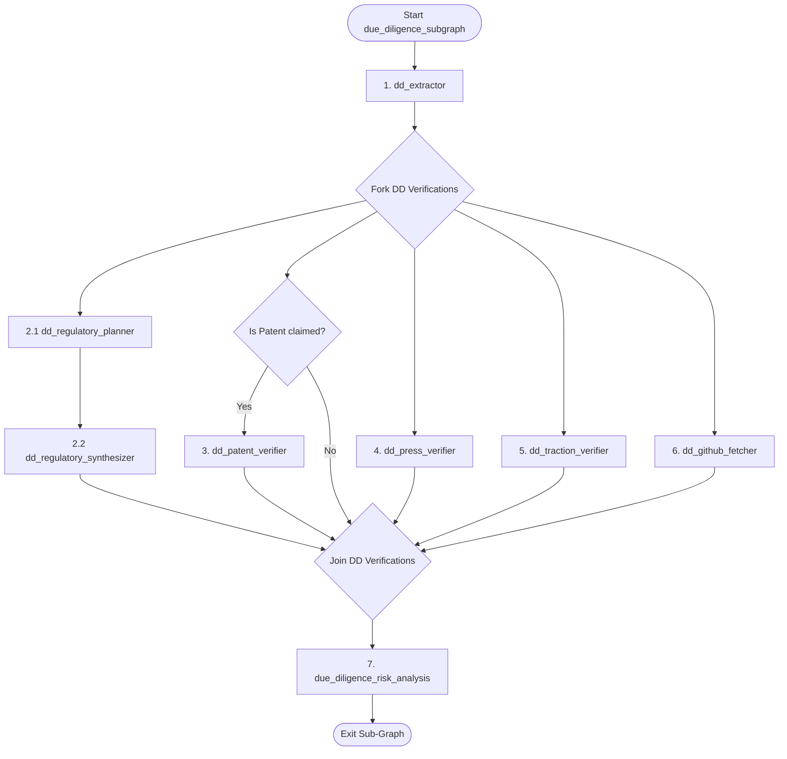

# Sub-Graph Specification: Due-Diligence Sub-Graph (due_diligence_subgraph)

## Aim
Verify the startup's regulatory standing, legal exposures, intellectual property (patents), claimed press coverage, GitHub engineering signals, and stated traction metrics using targeted external search and crawl tools. The sub-graph parallelizes these verifications and aggregates findings to isolate external red flags and form a cohesive due-diligence memo.

---

## 1. Sub-Graph Architecture

The Due-Diligence Sub-Graph uses a Fork-Join model to run independent checks concurrently.

---

## 2. Shared State & Schema Boundaries
The sub-graph reads from the global `PipelineGraphState` and writes strictly to the **`AnalysisState.due_diligence`** namespace (`DueDiligenceSchema` in `vs_analyst/schemas/due_diligence.py`).

---

## 3. Node Specifications

### 3.1 Node 1: `dd_extractor`
* **Aim**: Parse raw text to build a verification checklist of claimed traction, press, and patent items.
* **Inputs**:
  - `PipelineGraphState.raw_deck_text`
* **Working Flow**:
  1. Extract stated traction metrics, named press articles, and patent application numbers.
  2. Populate empty target placeholder entries in `traction_checks` and `patent_mentions` to act as work items.

---

### 3.2 Nodes 2.1 & 2.2: Regulatory & Legal Verification (Planner + Synthesizer)
* **`dd_regulatory_planner`**:
  * **Aim**: Formulate compliance and search queries based on the company's sector and HQ geography.
  * **Working Flow**: Checks the startup's sector (e.g. Fintech) and plans compliance-focused search queries: `"[Company Name] regulatory license compliance"` or lawsuit audits: `"[Company Name] lawsuit legal dispute"`.
* **`dd_regulatory_synthesizer`**:
  * **Aim**: Consolidate compliance crawled summaries.
  * **Working Flow**: Writes verified compliance details to `regulatory_flags` and legal exposures to `legal_notes`.

---

### 3.3 Node 3: `dd_patent_verifier` (Conditional)
* **Aim**: Verify the legitimacy and current ownership of claimed patents.
* **Inputs**: Stated patent details in state.
* **Tools Available**: `deep_research_tool`.
* **Working Flow**:
  1. Queries search engines and patent registries: `"site:patents.google.com [Patent Number] OR [Company Name]"`.
  2. Confirms patent status (Active, Pending, Expired) and assigns ownership details.
  3. Writes findings to `patent_mentions`.

---

### 3.4 Node 4: `dd_press_verifier`
* **Aim**: Verify claimed press coverage and evaluate public media footprint.
* **Tools Available**: `deep_research_tool`.
* **Working Flow**:
  1. Searches for specific claimed publications: `"[Company Name] [Featured Publication] news"`.
  2. Resolves and checks if the article exists and references the company.
  3. Appends verified entries to `press_mentions` and synthesizes the media tone inside `press_summary`.

---

### 3.5 Node 5: `dd_traction_verifier`
* **Aim**: Validate stated revenue, customer counts, or growth rates against external signal sources.
* **Tools Available**: `deep_research_tool`.
* **Working Flow**:
  1. Reads claimed traction metrics from `AnalysisState.company.traction`.
  2. Generates queries to search for external traction signals (web traffic reports, App Store downloads, customer case studies).
  3. Populates `traction_checks` list with `TractionVerification` objects (claim, verified boolean, evidence summary, source URL).

---

### 3.6 Node 6: `dd_github_fetcher`
* **Aim**: Fetch open-source statistics for the company's public repositories if a GitHub URL is available.
* **Tools Available**: Custom stateless Git crawler API tool.
* **Working Flow**: Pulls repo count, open issues, commits in last 90 days, contributor count, and license type to populate `OrgGithubSignals`.

---

### 3.7 Node 7: `due_diligence_risk_analysis` (Reduce Node)
* **Aim**: Synthesize all verification branch outputs and isolate company-level red flags.
* **Inputs**: The fully populated `DueDiligenceSchema` fields.
* **Working Flow**:
  1. Review verified traction discrepancies, regulatory flags, and negative press signals.
  2. Write critical issues (e.g. uncorroborated revenue claims, active lawsuits, missing critical operating licenses) into `red_flags`.
  3. Author the final 2-3 paragraph due-diligence `summary` for the investment memo.
