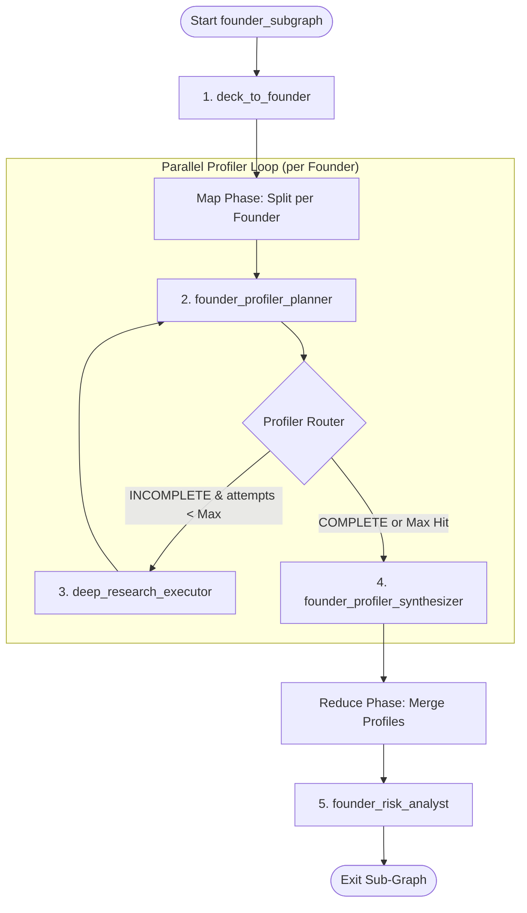

# Sub-Graph Specification: Founder Sub-Graph (founder_subgraph)

## Aim
Profile and verify the credentials, educational history, employment timelines, and background signals of each founder. The sub-graph executes in parallel for each founder, resolves profile gaps via an iterative planner-synthesizer loop, and audits the gathered information against pitch deck claims to isolate background red flags.

---

## 1. Sub-Graph Architecture

The Founder Sub-Graph coordinates the extraction, concurrent profiler loops, and final risk audits.

---

## 2. Shared State & Schema Boundaries
The sub-graph reads from the global `PipelineGraphState` and writes strictly to the **`AnalysisState.founder`** namespace (`FounderSchema` in `vs_analyst/schemas/founder.py`).

---

## 3. Node Specifications

### 3.1 Node 1: `deck_to_founder` (Seed Extractor)
* **Aim**: Perform initial extraction of founder details from pitch deck raw texts.
* **Inputs**:
  - `PipelineGraphState.raw_deck_text`
  - `PipelineGraphState.raw_website_text`
* **Output Structure**: Maps to `FounderAdaptor` in `vs_analyst/schemas/adapters.py`.
* **Working Flow**:
  1. Extract full names, stated roles, LinkedIn URLs, and `bio_from_deck` from raw text.
  2. Instantiate a `FounderSchema` record for each extracted founder and write them into the list `AnalysisState.founder.founders`.

---

### 3.2 Node 2: `founder_profiler_planner` (Branch-Local Node)
* **Aim**: Audit current founder profile state and plan targeted check queries.
* **Inputs**:
  - `competitor` (contains branch-local `FounderSchema` item).
  - `founder_research_attempts` (`int` loop counter).
* **Tools Available**: None.
* **Working Flow**:
  1. Check loop limit: If `founder_research_attempts >= 2`, return `status = COMPLETE`.
  2. Audit profile gaps:
     * Check if `linkedin_url` is missing.
     * Check if `past_companies`, `past_roles`, or `education` lists are empty.
  3. Generate queries:
     * If `linkedin_url` is missing, plan a query to find it: `"Founder [Name] [Company] LinkedIn profile"`.
     * If LinkedIn URL is present but profile details are missing, plan 1-2 positive check queries: `"Founder [Name] career history education"` or `"Founder [Name] [Past Company] role"`.
  4. Return `FounderPlannerDecision` object containing the `status` and planned `queries`.

---

### 3.3 Node 3: `founder_profiler_synthesizer` (Branch-Local Node)
* **Aim**: Parse crawled results, resolve discrepancies, and update the schema.
* **Inputs**:
  - `competitor` (contains branch-local `FounderSchema` item).
  - Branch-local `research_sources` containing raw crawls.
* **Tools Available (Utility Only — No Internet Access)**:
  - **`years_since(year)`**: For calculating years elapsed at past positions or graduation gaps.
* **Working Flow**:
  1. Parse crawled markdown summaries and match details against `FounderSchema` fields.
  2. Map schools, branches, and passing years into `FounderSchema.education`.
  3. Populate `past_companies`, `past_roles`, and `linkedin_summary` with parsed details.
  4. If a LinkedIn URL was discovered during this run, update `linkedin_url`.
  5. Return the updated `FounderSchema` object.

---

### 3.4 Node 4: `founder_risk_analyst` (Reduce Node)
* **Aim**: Audit the compiled founder background profiles against stated pitch deck claims.
* **Inputs**:
  - `AnalysisState.founder.founders` (the list of fully compiled founder profiles).
* **Tools Available**: None.
* **Working Flow**:
  1. Compare each founder's `verified_background` and `past_roles` against their `bio_from_deck`.
  2. Audit for:
     * **Employment Gaps**: Unexplained career breaks > 1 year.
     * **Title Inflation**: Stated deck role is significantly higher than verified (e.g., stated CEO, verified Junior Associate).
     * **Undisclosed Gaps**: Gaps in stated education passing years vs. actual career start.
  3. Write any identified inconsistencies as concern strings into the founder's `red_flags` list.
  4. Save the verified changes back to `AnalysisState.founder.founders`.
