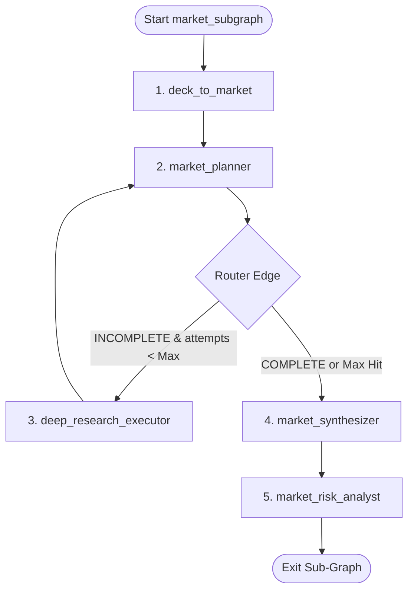

# Sub-Graph Specification: Market Sub-Graph Strategy

This document describes the compilation, internal loops, and state communication protocols of the compiled **Market Sub-Graph** (`market_subgraph`).

---

## 1. Sub-Graph Architecture & Compilation Flow

The Market Sub-Graph runs as a standalone nested state graph. It coordinates the initial extraction, gap planning loop, and final synthesis.

---

## 2. Child State Variable Contracts

The Market Sub-Graph maintains child-local and global variables. It is bound strictly to `AnalysisState.market`.

| Variable | Scope | Type | Owner | Purpose |
| :--- | :--- | :--- | :--- | :--- |
| `market_research_attempts` | Local | `int` | Orchestrator loop | Controls loop cutoff (default limit: 2) |
| `market_planner_decision` | Local | `MarketPlannerDecision` | `market_planner` | Triggers router edge branch |
| `market.research_sources` | Global | `List[ResearchSource]` | `deep_research_executor` | Accumulates markdown summaries & URLs |
| `market.queries_used` | Global | `List[str]` | `market_planner` | Avoids duplicating search terms |

---

## 3. Communication Protocols

### 3.1 Step 1: Initial Seed Extraction (`deck_to_market`)
* Reads `raw_deck_text` and `raw_website_text`.
* Populates initial founder claims into `AnalysisState.market` (`tam`, `sam`, `som`, `growth_rate`).

### 3.2 Step 2: Gap Planning Loop (`market_planner` $\rightarrow$ `deep_research_executor`)
* **The Planner** reviews the extracted claims against completeness criteria (are sizes sourced? is CAGR present?).
* If incomplete, generates **exactly 3 queries** with specific search goals and rationales.
* **The Executor** runs these queries in parallel using `deep_research_tool`. Crawl results are summarized and appended directly to `market.research_sources`.
* The local loop counter `market_research_attempts` increments.

### 3.3 Step 3: Synthesis & Verification (`market_synthesizer`)
* Integrates founder claims with the verified external crawled data under `market.research_sources`.
* **Reconciliation Rules**: Independent market reports take precedence.
* Utilizes **cognitive utility tools** (`parse_numeric_value`, `calculate_percentage`) to compute market discrepancies.
* Overwrites `tam`, `sam`, `som`, `growth_rate`, `key_trends`, and `summary` with verified values.
* Updates `overall_confidence` (`HIGH`, `MEDIUM`, or `LOW`).

### 3.4 Step 4: Risk Analysis (`market_risk_analyst`)
* Performs final analytical threat assessment, documenting compliance, growth, and structural barriers.

---

## 4. Parent-Child State Syncing (Reduce)
Upon exiting `market_subgraph`, all local graph variables (`market_research_attempts`, `market_planner_decision`) are cleaned up. The persistent changes to `AnalysisState.market` are safely returned and merged into the parent graph's global `AnalysisState` object.
