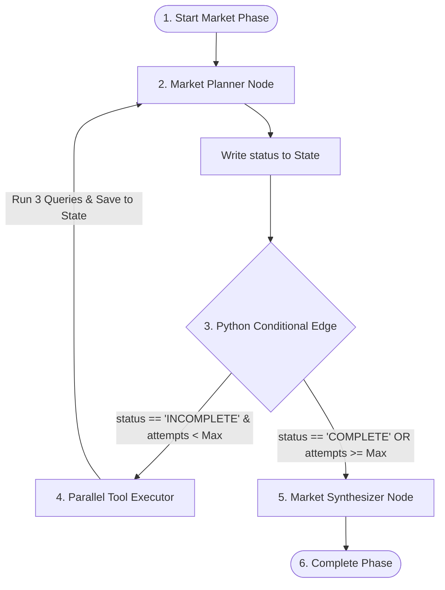

# Architecture Specification: State-Driven Python Routing (Hybrid Routing Pattern)

> [!NOTE]
> **Architectural Pivot:** This document describes the original flat-graph routing design for the Market Research loop. The project has since adopted the **Sub-Graph Orchestration Pattern**. For the current production architecture, refer to [market_communication_strategy.md](file:///c:/Users/23add/workspace/The-Automated-Venture-Capital-VC-Investment-Analyst/apps/analyst/docs/nodes/market_communication_strategy.md). This file is retained as a reference for the underlying Python router implementation pattern which is still used inside the Market Sub-Graph.

This document describes the routing architecture for the Market Analysis phase of the VC Investment Analyst Service. It implements the **State-Driven Python Routing (Hybrid)** pattern, which is the industry standard for production-grade agentic workflows.


---

## 1. Architectural Concept

Instead of relying on a costly and non-deterministic LLM "Supervisor" node to choose the next step in the pipeline, routing is controlled programmatically by a Python `conditional_edge`. The LLM agent (the `market_planner`) remains responsible for the **semantic evaluation** of the state and records its decision into a structured state variable. The Python router then reads this variable to route the graph deterministically.



---

## 2. State & Configuration

### Env Configuration (`.env`)
```bash
MARKET_RESEARCH_MAX_ATTEMPTS=2
```

### Config Class Settings (`config.py`)
```python
market_research_max_attempts: int = Field(default=2, alias="MARKET_RESEARCH_MAX_ATTEMPTS")
```

### Graph State additions (`schemas/state.py` / `schemas/market.py`)
- `market_research_attempts` (`int`): Transient loop counter tracking iterations.
- `market_planner_decision` (`MarketPlannerDecision`, Optional): The structured output of the last planner execution.

---

## 3. Router Implementation Specification

The routing function `route_market_research` is defined in the orchestrator layer. It executes with zero LLM overhead.

```python
def route_market_research(state: PipelineGraphState) -> str:
    """
    Deterministic routing function for the Market Research loop.
    """
    # 1. Safety Guardrail: Force transition if attempts reach maximum limit
    attempts = state.get("market_research_attempts", 0)
    max_attempts = settings.market_research_max_attempts
    
    if attempts >= max_attempts:
        return "market_synthesizer"
        
    # 2. Semantic Evaluation Check: Read the Planner's decision
    decision = state.get("market_planner_decision")
    if not decision:
        # Fallback to planner if no decision exists
        return "market_planner"
        
    if decision.status == "COMPLETE":
        return "market_synthesizer"
        
    # 3. Default Path: Route to tool executor
    return "execute_market_research"
```

---

## 4. Key Benefits & Design Trade-offs

| Aspect | Hybrid Routing Pattern (Proposed) | LLM Supervisor Pattern |
| :--- | :--- | :--- |
| **Deterministic Behavior** | **100% Guaranteed.** The routing code is simple Python logic. | **Low.** The LLM can hallucinate route target names or violate limits. |
| **Latency & Cost** | **Zero Overhead.** No additional LLM calls are executed for routing. | **High.** An LLM call is executed at every single hop in the graph. |
| **Safety Guardrails** | **Robust.** Hard limits (e.g. `max_attempts`) are enforced by Python. | **Soft.** LLMs can ignore boundaries or context counters. |
| **Agent Agency** | **Preserved.** The Planner LLM agent decides when data is sufficient. | **Preserved.** The LLM determines the path. |
