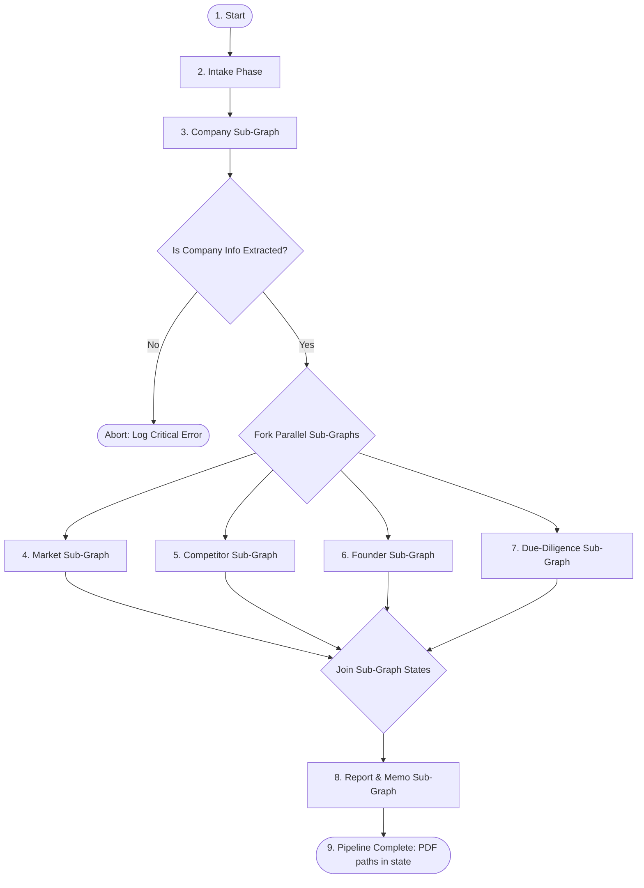

# Parent Graph Orchestrator: Master Architecture Spec

This document describes the orchestration, routing, and parallel execution model of the top-level parent LangGraph in the VC Investment Analyst Service.

---

## 1. Top-Level Workflow Architecture

The parent graph coordinates sequential dependency gates and concurrent sub-graphs using a Fork-Join (Map-Reduce) model.

---

## 2. Parent Graph State Schema (`PipelineGraphState`)

The shared global state variable is `PipelineGraphState`. It contains two categories of variables:
1. **Transient Graph Variables**: State controllers for orchestrator routing (e.g., attempt counters, planner decisions).
2. **Persistent Analysis State (`AnalysisState`)**: The core database schema that holds all extracted details and is updated incrementally by each sub-graph.

### 2.1 State Namespace Boundaries (Strict Data Isolation)
To prevent write conflicts and race conditions during parallel execution, each sub-graph is assigned a strict write-only boundary in the `AnalysisState`:

| Sub-Graph | Input Contexts (Read-Only) | Output Namespace (Write-Only) |
| :--- | :--- | :--- |
| **Intake Phase** | `user_input` | `raw_deck_text`, `raw_website_text` |
| **Company Sub-Graph** | `raw_deck_text`, `raw_website_text` | `AnalysisState.company` |
| **Market Sub-Graph** | `AnalysisState.company`, raw text | `AnalysisState.market` |
| **Competitor Sub-Graph** | `AnalysisState.company`, raw text | `AnalysisState.competitive` |
| **Founder Sub-Graph** | `AnalysisState.company`, raw text | `AnalysisState.founders` |
| **Due-Diligence Sub-Graph** | `AnalysisState.company`, raw text | `AnalysisState.due_diligence` |
| **Report Sub-Graph** | All completed namespaces (read-only) | `AnalysisState.memo` |

---

## 3. Sequential Initialization Phase

### 3.1 Step 1: Intake Phase (`pitch_deck_analysis`)
* **Role**: Parses raw PDFs, processes slide images via VLM, crawls company URLs, and populates raw text strings into `PipelineGraphState`.
* **Output Gate**: Transitions unconditionally to `company_subgraph` once raw strings are available.

### 3.2 Step 2: Company Sub-Graph (`company_subgraph`)
* **Role**: Extracts baseline company context (business model, sector, HQ location, ICP).
* **Gatekeeper Rule**: The company profile is the **dependency gate**. Parallel sub-graphs cannot build queries or evaluate context without knowing the sector and ICP. 
* **State Check**: If `AnalysisState.company.name` or `sector` is missing after this phase, the pipeline logs a critical error and aborts to prevent wasted API costs.

---

## 4. Parallel Fork-Join Phase (Map-Reduce)

Once the Company profile is verified, the parent orchestrator forks the execution into 4 concurrent sub-graphs.

### 4.1 State Merging on Join
When all 4 parallel sub-graphs complete, they return their updated namespaces. The parent graph uses a state reducer to merge the namespaces into the final `AnalysisState` object.
* **Reducer Rules**:
  * Since each sub-graph writes to a completely distinct dictionary key in the state (`market`, `competitive`, `founder`, `due_diligence`), the global reducer combines these keys with zero collision.
  * Intermediate transient variables used inside sub-graphs (e.g., attempt counters) are branch-isolated and do not leak into the parent state.

---

## 5. Report Synthesis and Completion

Once all parallel streams are safely joined, the **Report & Memo Sub-Graph** executes in three internal phases. For full node-level details, see [report_sub_graph.md](file:///c:/Users/23add/workspace/The-Automated-Venture-Capital-VC-Investment-Analyst/apps/analyst/docs/nodes/report_sub_graph.md).

**Phase 1 — Drafting**: Five section writers run in parallel (`executive_summary_writer`, `market_section_writer`, `competitor_section_writer`, `founder_section_writer`, `dd_section_writer`). Each writes a Markdown narrative for its assigned `MemoSection`.

**Phase 2 — Advisory Debate**: Four adversarial agents run in parallel (`investment_advocate`, `investment_adversary`, `growth_strategist`, `hazard_mitigator`). Their outputs are synthesized by the `venture_partner_ic_agent` into the final `InvestmentRecommendation`, populating `verdict`, `conviction_score`, `do_list`, and `stop_list`. The `memo_reviewer` (LLM-as-a-Judge) then audits factual integrity and routes rejected sections back for revision (max 2 review cycles).

**Phase 3 — Compilation**: `vector_diagram_generator` produces programmatic SVG strings (competitive 2x2 quadrant, traction sparkline, moat radar). `document_compiler` renders the Jinja2 HTML and Jinja2 Typst templates and exports two PDFs:
- `AnalysisState.memo.html_pdf_path` → `outputs/{run_id}/memo_web.pdf` (Pattern A: Web-Sleek via Playwright)
- `AnalysisState.memo.typst_pdf_path` → `outputs/{run_id}/memo_typst.pdf` (Pattern B: Institutional via Typst)

**Upload Responsibility**: The sub-graph writes local file paths to state only. S3/Minio upload is handled by a thin Python service layer **outside the graph**, keeping storage infrastructure decoupled from the pipeline logic.
