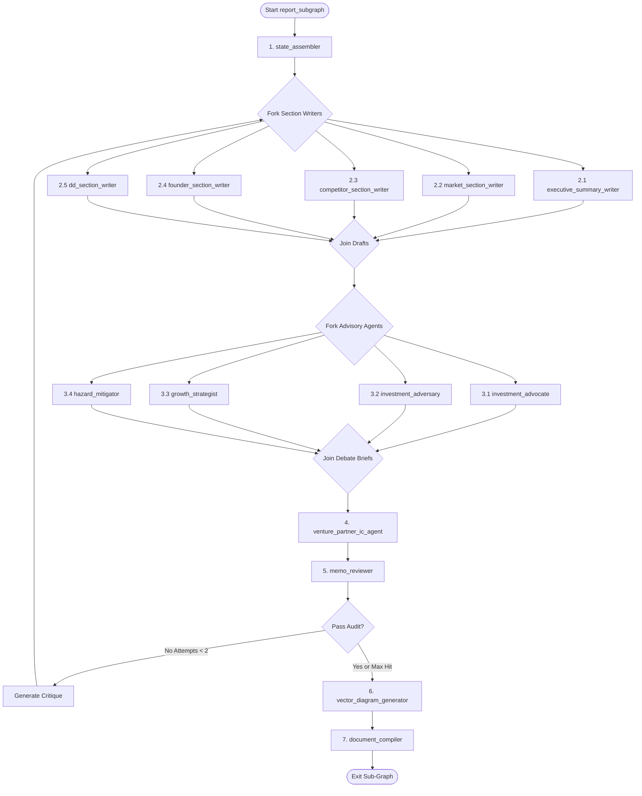

# Sub-Graph Specification: Report & Memo Sub-Graph (report_subgraph)

## Aim
Transform the fully populated `AnalysisState` into a professional, information-rich investment memo.
The sub-graph operates in three sequential phases:
1. **Drafting Phase** — Parallel section writers produce structured factual narratives.
2. **Advisory Debate Phase** — Specialized adversarial agents generate polarized recommendation briefs.
3. **Compilation Phase** — Templates are rendered into two PDF formats written to local temp storage.

---

## 1. Sub-Graph Architecture

---

## 2. Shared State & Schema Boundaries
* **Reads from**: All `AnalysisState` namespaces (`company`, `market`, `competitive`, `founders`, `due_diligence`).
* **Writes to**: `AnalysisState.memo` (`MemoSchema` in `vs_analyst/schemas/memo.py`).
* **No internet access** in any node. All reasoning is over already-gathered state data.

---

## 3. Phase 1 — Parallel Section Writers

### 3.1 Node 1: `state_assembler`
* **Aim**: Validate that all upstream namespaces are populated and assemble a clean, read-only `AnalysisBundle` context object for downstream nodes to consume.
* **Tools**: None.
* **Working Flow**:
  1. Check that each namespace has at least the minimum fields populated (e.g. `company.name` not None, `market.tam` present, `competitive.competitors` non-empty).
  2. If a namespace is empty, log a `MemoCaveat` (e.g. *"Due-Diligence verification was skipped — section will be based on deck claims only"*).
  3. Return control to the fork.

---

### 3.2 Nodes 2.1–2.5: Section Writers (Parallel, No-Tool Cognitive Nodes)
Each writer reads its corresponding namespace and produces a richly formatted **Markdown string** for exactly one `MemoSection`. They never touch another namespace.

| Node | Reads From | Writes To | Content Produced |
| :--- | :--- | :--- | :--- |
| `executive_summary_writer` | All namespaces (summary only) | `memo.executive_summary` | 2-paragraph narrative: company identity, verdict signal, highlight traction. |
| `market_section_writer` | `AnalysisState.market` | `memo.market_analysis` | Verified TAM/SAM/SOM table, CAGR chart reference, growth narrative, top 3 trends. |
| `competitor_section_writer` | `AnalysisState.competitive` | `memo.competitive_landscape` | Moat score, competitive landscape narrative, 2x2 quadrant SVG reference, top 3 threats. |
| `founder_section_writer` | `AnalysisState.founders` | `memo.team_assessment` | Per-founder verified background summary, role fit evaluation, red flag callouts. |
| `dd_section_writer` | `AnalysisState.due_diligence` | `memo.due_diligence_notes` | Traction verification table, press coverage summary, regulatory flags, legal notes. |

> **Design Rule**: Section writers produce **only Markdown text**. They never generate HTML, Typst syntax, or SVG directly. This completely eliminates compile-level syntax bugs at the template rendering stage.

---

## 4. Phase 2 — Advisory Debate Phase

### 4.1 Node 3.1: `investment_advocate` (The Bull)
* **Persona Constraint**: Act as the partner who sourced the deal. Your brief must make the strongest possible investment case.
* **Sources**: Focuses on high-verified traction, strong CAGR, defensible moat types, and proven founder exits.
* **Output** (`InvestmentBrief`):
  - `stance` = `"INVEST"`
  - `thesis` (`str`): A compelling 2–3 paragraph investment thesis.
  - `supporting_evidence` (`List[str]`): 4–6 specific, state-sourced evidence points.

### 4.2 Node 3.2: `investment_adversary` (The Bear)
* **Persona Constraint**: Act as the internal risk partner whose job is to prevent bad investments. Your brief must identify every structural flaw.
* **Sources**: Focuses on unverified traction claims, weak moat scores, heavy competitor capital, legal/regulatory flags, and founder red flags.
* **Output** (`InvestmentBrief`):
  - `stance` = `"PASS"`
  - `thesis` (`str`): A critical 2–3 paragraph risk brief.
  - `supporting_evidence` (`List[str]`): 4–6 specific, state-sourced concern points.

### 4.3 Node 3.3: `growth_strategist` (The "What To Do" List)
* **Aim**: Identify 3–5 concrete, high-leverage growth actions the company could take *immediately* to improve its position.
* **Sources**: Cross-references competitor weaknesses against startup's product stage, untapped geographies, and pricing opportunities.
* **Output** (`StrategicDirective`):
  - `directive_type` = `"DO"`
  - `actions` (`List[str]`): Each item must include a rationale sourced from the state.

### 4.4 Node 3.4: `hazard_mitigator` (The "Stop-Doing" List)
* **Aim**: Identify 3–5 operational or strategic behaviors the company is currently doing that are harmful.
* **Sources**: Audits `company.red_flags`, verified traction gaps, and competitive position vulnerabilities.
* **Output** (`StrategicDirective`):
  - `directive_type` = `"STOP"`
  - `actions` (`List[str]`): Each item must include a rationale sourced from the state.

---

### 4.5 Node 4: `venture_partner_ic_agent`
* **Aim**: Act as the Investment Committee Chairperson. Weigh the Advocate's brief against the Adversary's brief, and factor in the strategic directives, to produce a final, balanced `InvestmentRecommendation`.
* **Inputs**: The four `InvestmentBrief` and `StrategicDirective` outputs.
* **Tools**: `calculate_percentage` (cognitive utility, to express risk/reward ratios).
* **Output** (`InvestmentRecommendation`) written to `AnalysisState.memo.recommendation`:
  - `verdict` (`RecommendationVerdict`: `INVEST`, `WATCH`, `PASS`)
  - `conviction_score` (`int` 1–10): Overall conviction level.
  - `investment_thesis` (`str`): Balanced 3-paragraph synthesis.
  - `key_strengths` (`List[str]`): Top 4 validated positive signals.
  - `key_risks` (`List[str]`): Top 4 identified risk factors.
  - `do_list` (`List[str]`): Adopted from `growth_strategist` output.
  - `stop_list` (`List[str]`): Adopted from `hazard_mitigator` output.
  - `conditions` (`List[str]`): Pre-investment checklist items.
  - `next_steps` (`List[str]`): Concrete actions for the analyst.
  - `fund_fit_note` (`Optional[str]`): Alignment with the fund's stated thesis.

---

## 5. Node 5: `memo_reviewer` (LLM-as-a-Judge)
* **Aim**: Perform a strict factual integrity audit. Detect distortions, hallucinations, and omissions in the drafted text.
* **Inputs**: All `MemoSection` strings and `InvestmentRecommendation`.
* **Audit Checks**:
  1. **Factual Pinning**: Spot-check 3–5 specific numerical claims in the drafts (e.g. TAM figure, competitor funding amount) against the actual `AnalysisState` field values.
  2. **Omission Check**: Verify that every `red_flag` in `company.red_flags`, `founders[n].red_flags`, and `due_diligence.red_flags` appears somewhere in the memo.
  3. **Verdict Coherence**: Check that `conviction_score`, `key_risks`, and `verdict` are internally consistent.
* **Output** (`ReviewDecision`):
  - `status` (`Literal["APPROVED", "REJECTED"]`).
  - `critiques` (`List[SectionCritique]`): Per-section feedback if rejected.
    - `section_name` (`str`)
    - `issue` (`str`): Specific factual discrepancy or omission found.
    - `correction_instruction` (`str`): Targeted instruction for the re-write.
* **Routing**: If `REJECTED` and `review_attempts < 2`, routes back to the start of Phase 1 with the critiques injected into the section writers' prompts.

---

## 6. Node 6: `vector_diagram_generator`
* **Aim**: Produce programmatic SVG strings for all visual elements used in the report templates.
* **Tools**: None (pure Python SVG generation — zero LLM calls).
* **Diagrams Produced**:
  1. **Competitive 2x2 Quadrant SVG**: X-axis = "Market Scope", Y-axis = "Funding Power". Plots each competitor as a named circle with competitor type color-coding.
  2. **Traction Sparkline SVG**: Line chart for MRR/user growth trends if metrics are available.
  3. **Moat Radar SVG**: Spider-chart across the 7 Hamilton Powers moat dimensions.
* **Output**: Raw SVG XML strings written to `AnalysisState.memo.diagrams` (`Dict[str, str]`).

---

## 7. Node 7: `document_compiler`
* **Aim**: Render both PDF format versions to a local temp directory and write file paths to state.
* **Tools**:
  - **`jinja2_html_renderer`** (stateless utility): Takes sections + SVGs + recommendation → renders Jinja2 HTML template → returns compiled HTML string.
  - **`playwright_pdf_exporter`** (stateless utility): Takes HTML string → spawns headless Chromium → exports Pattern A PDF.
  - **`typst_pdf_exporter`** (stateless utility): Takes sections + SVGs + recommendation → renders Jinja2 Typst template → runs `typst compile` CLI → exports Pattern B PDF.
* **Working Flow**:
  1. Render and export Pattern A (`memo_web.pdf`) and Pattern B (`memo_typst.pdf`) to a temp directory under `outputs/{run_id}/`.
  2. Write absolute file paths to `AnalysisState.memo.html_pdf_path` and `AnalysisState.memo.typst_pdf_path`.
  3. Exit the sub-graph.

> **Note on Upload Responsibility**: The Report Sub-Graph does **not** upload files to S3/Minio. That responsibility belongs to a thin Python service layer outside the graph, which reads the file paths from the final state. This decouples the graph from storage infrastructure.
